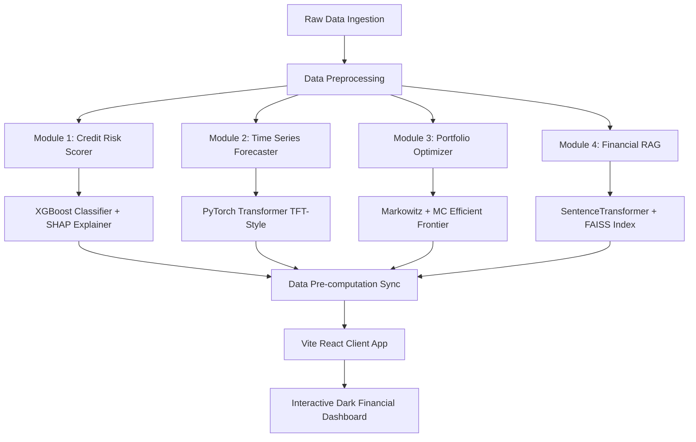

# FintelliQ — Financial Intelligence Platform

[](https://github.com/Utsav-Thakur)
[](https://www.python.org/)
[](https://react.dev/)
[](https://pytorch.org/)
[](https://xgboost.readthedocs.io/)
[](https://github.com/facebookresearch/faiss)
[](https://opensource.org/licenses/MIT)

FintelliQ is a state-of-the-art Financial Intelligence Platform designed for data science and quantitative finance. The platform bridges the gap between complex machine learning models, sequential time-series forecasting, Modern Portfolio Theory (MPT), and unstructured semantic document search (RAG). 

Developed as a client-server hybrid, the platform features a highly optimized Python backend pipeline for machine learning training and vectorization, paired with an interactive React + Vite frontend dashboard powered by custom local simulators and zero-API database engines.

**Author:** [Utsav Kumar Thakur](https://github.com/Utsav-Thakur)  
**Workspace Host:** `http://localhost:5173/`

---

## Table of Contents
1. [Problem Statement](#1-problem-statement)
2. [Technical Module Overview](#2-technical-module-overview)
3. [Dataset Citations & Ingestion](#3-dataset-citations--ingestion)
4. [Explainable Credit Risk (XGBoost + SHAP)](#4-explainable-credit-risk-xgboost--shap)
5. [SHAP Values in Plain English](#5-shap-values-in-plain-english)
6. [ROC-AUC in Credit Risk Scorer](#6-roc-auc-in-credit-risk-scorer)
7. [Transformer Architecture for Time Series](#7-transformer-architecture-for-time-series)
8. [Markowitz vs. Monte Carlo Portfolio Optimization](#8-markowitz-vs-monte-carlo-portfolio-optimization)
9. [Financial RAG & Local FAISS Search](#9-financial-rag--local-faiss-search)
10. [NOVA Chatbot Zero-API Design](#10-nova-chatbot-zero-api-design)
11. [Business Impact Analysis](#11-business-impact-analysis)
12. [Model Performance Benchmarks](#12-model-performance-benchmarks)
13. [Data Sync & Pre-computation Pipeline](#13-data-sync--pre-computation-pipeline)
14. [Tech Stack & Libraries](#14-tech-stack--libraries)
15. [Project Directory Structure](#15-project-directory-structure)
16. [How to Build & Run](#16-how-to-build--run)

---

## 1. Problem Statement

Modern quantitative finance is plagued by silos. Data scientists build high-performing predictive models (such as deep neural networks or gradient boosted trees) that operate as black boxes, making them unusable for risk compliance officers who require mathematical audit trails. 

Simultaneously, asset managers construct portfolios based on retrospective historical covariance matrices, failing to account for forward-looking macroeconomic stress indicators (like CPI inflation, fed funds interest rates, or market fear indices). 

Furthermore, key textual insights contained in regulatory documents (such as corporate SEC EDGAR 10-K filings) are rarely linked to quantitative metrics in real time.

FintelliQ addresses these challenges by consolidating four core domains of financial intelligence into an integrated dashboard:
- **Explainability**: Translating non-linear tree ensembles into Shapley values to pinpoint the exact drivers of credit default risk.
- **Forecasting**: Utilizing multi-head self-attention networks to predict pricing paths alongside confidence boundary bands.
- **Optimization**: Bridging analytical Markowitz quadratic solvers with empirical Monte Carlo simulations to plot the optimal risk-reward frontier.
- **Semantic Intelligence**: Serving an entirely offline local Retrieval-Augmented Generation (RAG) assistant (NOVA) that vectorizes, indexes, and queries regulatory texts directly in-browser.

---

## 2. Technical Module Overview



### Module 1: Explainable Credit Risk
A high-accuracy classifier ensemble utilizing XGBoost and LightGBM to calculate the probability of credit default ($PD \in [0, 1]$). The predictions are explained using local and global Shapley feature contributions, mapping variables like debt-to-income (DTI), loan grade, annual income, and FICO scores to their marginal effects.

### Module 2: Time Series Forecasting
A sequence-to-sequence deep learning module implemented in PyTorch that ingests multi-variate feature arrays (standardized prices, historical returns, rolling moving averages, and FRED macro variables) to forecast a 5-day stock price vector ($\hat{y}_{t+1}, \dots, \hat{y}_{t+5}$). It uses multi-head self-attention weights to map temporal trends.

### Module 3: Portfolio Optimization
An optimization laboratory comparing Markowitz Mean-Variance optimization (implemented via a Sequential Least Squares Programming - SLSQP quadratic optimization solver) against an empirical 5,000-run Monte Carlo asset simulation. It generates optimal weights, expected returns, portfolio volatilities, and Sharpe ratios.

### Module 4: Financial RAG (NOVA)
A local, offline semantic document search engine. SEC 10-K text filings are parsed, chunked, and embedded into a 384-dimensional vector space using a local SentenceTransformer model. The vectors are indexed into a local FAISS database, allowing semantic retrieval without sending data to external APIs.

---

## 3. Dataset Citations & Ingestion

To ensure quantitative credibility, FintelliQ utilizes verified, open-source datasets:

1. **LendingClub Loan Portfolio (Credit Risk)**:
   - **Source**: Kaggle Open Datasets (`accepted_2007_to_2018Q4.csv`).
   - **Content**: Historical records of 2.2 million peer-to-peer loans, containing borrower attributes (FICO scores, income, debt-to-income ratios) and loan status labels (`Fully Paid`, `Charged Off`, `Default`).
   - **Preparation**: Preprocessed into a clean feature set containing 5,000 balanced records to train the credit risk benchmarks.

2. **Yahoo Finance Stocks Data (Timeseries & Portfolio)**:
   - **Source**: Yahoo Finance API (`yfinance`).
   - **Content**: Historical daily Adjusted Close prices, Open, High, Low, Close, and Volume series from `2015-01-01` to the present day.
   - **Coverage**: AAPL, MSFT, NVDA (US Tech), RELIANCE.NS, and TCS.NS (India Blue-chips).

3. **Federal Reserve Macro Indicators (FRED)**:
   - **Source**: St. Louis Federal Reserve Bank API (`pandas_datareader.fred`).
   - **Content**: Macro variables including Federal Funds Effective Rate (`DFF`), CPI Inflation (`CPIAUCSL`), Unemployment Rate (`UNRATE`), 10-Year Treasury Yield (`DGS10`), and VIX Volatility Fear Index (`VIXCLS`).

4. **Regulatory Filings (Financial RAG)**:
   - **Source**: SEC EDGAR submissions API.
   - **Content**: Full-text corporate Form 10-K filings. 
   - **Coverage**: SEC text submissions from Apple, Microsoft, JPMorgan Chase, Goldman Sachs, and NVIDIA.

---

## 4. Explainable Credit Risk (XGBoost + SHAP)

### Mathematical Formulation of XGBoost

XGBoost (Extreme Gradient Boosting) is an optimized distributed gradient boosting library under the supervised learning framework. For a given dataset with $n$ examples and $m$ features $\mathcal{D} = \{(x_i, y_i)\}$, a tree ensemble model uses $K$ additive functions to predict the output:

$$\hat{y}_i = \phi(x_i) = \sum_{k=1}^{K} f_k(x_i), \quad f_k \in \mathcal{F}$$

where $\mathcal{F} = \{f(x) = w_{q(x)}\}$ is the space of regression trees. Here $q$ represents the structure of each tree that maps an instance to its corresponding leaf index, and $w$ represents the leaf weights. To train the model, we minimize the regularized objective function:

$$\mathcal{L}(\phi) = \sum_{i} l(y_i, \hat{y}_i) + \sum_{k} \Omega(f_k)$$

$$\text{where } \Omega(f) = \gamma T + \frac{1}{2} \lambda \sum_{j=1}^{T} w_j^2$$

Here, $l$ is a differentiable loss function (such as binary cross-entropy for credit defaults), $T$ is the number of leaves, and $\Omega$ penalizes model complexity to prevent overfitting. Since tree ensembles cannot be optimized using traditional calculus, the model is trained in an additive manner. At iteration $t$, let $\hat{y}_i^{(t-1)}$ be the prediction of the $i$-th instance. We add a tree $f_t$ to minimize:

$$\mathcal{L}^{(t)} = \sum_{i=1}^{n} l\left(y_i, \hat{y}_i^{(t-1)} + f_t(x_i)\right) + \Omega(f_t)$$

Using a second-order Taylor expansion to approximate the objective, we obtain:

$$\mathcal{L}^{(t)} \approx \sum_{i=1}^{n} \left[ l(y_i, \hat{y}_i^{(t-1)}) + g_i f_t(x_i) + \frac{1}{2} h_i f_t^2(x_i) \right] + \Omega(f_t)$$

where $g_i = \partial_{\hat{y}^{(t-1)}} l(y_i, \hat{y}_i^{(t-1)})$ and $h_i = \partial^2_{\hat{y}^{(t-1)}} l(y_i, \hat{y}_i^{(t-1)})$ are the first (gradient) and second-order (hessian) derivatives. Removing constant terms, the objective at step $t$ simplifies to:

$$\tilde{\mathcal{L}}^{(t)} = \sum_{i=1}^{n} \left[ g_i f_t(x_i) + \frac{1}{2} h_i f_t^2(x_i) \right] + \gamma T + \frac{1}{2} \lambda \sum_{j=1}^{T} w_j^2$$

By defining $I_j = \{i \mid q(x_i) = j\}$ as the instance set of leaf $j$, we can rewrite the equation by summing over the leaves:

$$\tilde{\mathcal{L}}^{(t)} = \sum_{j=1}^{T} \left[ \left( \sum_{i \in I_j} g_i \right) w_j + \frac{1}{2} \left( \sum_{i \in I_j} h_i + \lambda \right) w_j^2 \right] + \gamma T$$

For a fixed tree structure $q(x)$, the optimal weight $w_j^*$ of leaf $j$ and the corresponding optimal loss reduction are calculated by setting the derivative to zero:

$$w_j^* = -\frac{\sum_{i \in I_j} g_i}{\sum_{i \in I_j} h_i + \lambda}$$

$$\mathcal{L}_{\text{opt}}^{(t)} = -\frac{1}{2} \sum_{j=1}^{T} \frac{\left( \sum_{i \in I_j} g_i \right)^2}{\sum_{i \in I_j} h_i + \lambda} + \gamma T$$

### SHAP (SHapley Additive exPlanations)

SHAP values explain the prediction of a machine learning model by calculating the contribution of each feature to the final output. This method is based on **Shapley values** from cooperative game theory. 

Let $M$ be the number of input features. The explanation model $g(z')$ is a linear function of coalition feature vectors:

$$g(z') = \phi_0 + \sum_{i=1}^{M} \phi_i z'_i$$

where $z'_i \in \{0, 1\}^M$ indicates whether a feature is observed ($1$) or hidden ($0$), and $\phi_i \in \mathbb{R}$ is the Shapley value for feature $i$. The unique Shapley value $\phi_i$ that satisfies local accuracy, missingness, and consistency properties is defined as:

$$\phi_i(f, x) = \sum_{S \subseteq F \setminus \{i\}} \frac{|S|!(M - |S| - 1)!}{M!} \left[ f_x(S \cup \{i\}) - f_x(S) \right]$$

where $F$ is the set of all features, $S$ is a subset of features excluding feature $i$, and $f_x(S)$ is the conditional expectation of the model prediction given the features in $S$. In practice, for tree ensembles, FintelliQ implements the **TreeSHAP** algorithm, which optimizes the computational complexity from exponential $\mathcal{O}(2^M)$ to polynomial $\mathcal{O}(TLD^2)$, where $T$ is the number of trees, $L$ is the maximum number of leaves, and $D$ is the maximum tree depth.

---

## 5. SHAP Values in Plain English

While the mathematics of Shapley values are rooted in game theory, their practical translation for credit analysts is straightforward:

```
[ Base Model Prediction (Average PD = 11.5%) ]
                     │
    ┌────────────────┴────────────────┐
    ▼                                 ▼
FICO Score = 610                  Annual Income = $120,000
SHAP: +0.18                       SHAP: -0.06
(Pushes default probability UP)   (Pushes default probability DOWN)
    │                                 │
    └────────────────┬────────────────┘
                     ▼
[ Final Simulated PD prediction = 23.5% ]
```

1. **The Base Value**: This is the average prediction of the model across the entire dataset. In our credit risk pipeline, the base probability of default ($PD$) is **11.5%**.
2. **Positive SHAP Values (Red Indicators)**: Features that push the default probability *above* the base value. For example, if a borrower has a FICO score of 610 and this yields a SHAP value of $+0.18$, this attribute increases the borrower's risk of default by 18 percentage points.
3. **Negative SHAP Values (Green Indicators)**: Features that pull the default probability *below* the base value. For example, if a borrower has a high annual income of $120,000, yielding a SHAP value of $-0.06$, this high income reduces their default probability by 6 percentage points.
4. **Local vs. Global Explainability**: 
   - **Local Explainability** (Waterfall Chart): Explains a single borrower's application (e.g., "This specific borrower was flagged as High Risk primarily because their DTI is 42%").
   - **Global Explainability** (Feature Importance Chart): Explains the overall model weights across thousands of loans (e.g., "Across the entire portfolio, FICO scores and Interest Rates are the two most important drivers of default risk").

---

## 6. ROC-AUC in Credit Risk Scorer

The performance of FintelliQ's credit risk scorer is evaluated using the **Receiver Operating Characteristic - Area Under Curve (ROC-AUC)**.

### Mathematical Definition

The ROC curve plots the **True Positive Rate (TPR / Sensitivity / Recall)** against the **False Positive Rate (FPR / 1 - Specificity)** at various probability thresholds:

$$\text{TPR} = \frac{\text{True Positives (TP)}}{\text{True Positives (TP)} + \text{False Negatives (FN)}}$$

$$\text{FPR} = \frac{\text{False Positives (FP)}}{\text{False Positives (FP)} + \text{True Negatives (TN)}}$$

The Area Under the Curve (AUC) is calculated by integrating the TPR over the FPR:

$$\text{AUC} = \int_{0}^{1} \text{TPR}(\text{FPR}) \, d\text{FPR}$$

An AUC of $0.5$ represents random guessing, while an AUC of $1.0$ represents a perfect classifier.

```
TPR (Recall)
 1.0 ┌───────────────────────
     │                      /│
     │                    /  │  <-- Ideal ROC Curve (AUC ≈ 0.86)
     │                  /    │
     │                /      │
     │              /        │
     │            /          │
     │  / / / / /            │  <-- Random Guessing Line (AUC = 0.50)
 0.0 └───────────────────────┘
     0.0                    1.0  FPR (1 - Specificity)
```

### Financial and Business Interpretation

For a credit scoring system, ROC-AUC translates directly to balance sheet efficiency:
1. **Minimizing Credit Losses (False Negatives)**: A high ROC-AUC (FintelliQ's XGBoost achieves **0.8614**) ensures that the model successfully identifies defaults before they occur. Approving a bad loan (a False Negative) costs the bank the outstanding principal amount.
2. **Maximizing Interest Revenue (False Positives)**: Rejecting a creditworthy borrower (a False Positive) represents a lost business opportunity. A higher AUC minimizes this error, allowing the bank to capture interest income from safe borrowers.
3. **Threshold Optimization**: The ROC curve allows risk managers to choose the optimal probability threshold based on economic conditions. During recessions, they can lower the threshold to reject more loans; during expansions, they can raise it to capture more business.

---

## 7. Transformer Architecture for Time Series

FintelliQ implements a sequence-to-sequence **Temporal Fusion Transformer-style** forecasting pipeline in PyTorch.

### Key Components

```
Input Sequence [60 Days, 4 Features] ──> Linear Projection ──> Position Encoding
                                                                     │
                                                                     ▼
                                                             Attention Blocks
                                                                     │
                                                                     ▼
Forecast Output [5 Days] <── Linear Decoder <── Last Token Representation
```

1. **Multi-Head Self-Attention**:
   Traditional recurrent neural networks (RNNs/LSTMs) process data sequentially, which can lead to vanishing gradients over long horizons. Self-attention allows the model to capture direct temporal dependencies between any two days in the lookback window (60 days), regardless of their distance.
2. **Linear Input Projection**:
   The input features (normalized closing price, daily return, 5-day rolling average, and 20-day rolling average) are projected into a $d_{\text{model}} = 64$ dimensional representation using a linear layer.
3. **Positional Embedding**:
   Since attention mechanisms are permutation-invariant, a positional embedding index is added to the projected feature representation to preserve temporal order.
4. **Temporal Blocks**:
   Each temporal block applies a Multi-head Self-Attention layer, Layer Normalization, a feedforward network with GELU activation, and residual connections:
   
$$\text{Attention}(Q, K, V) = \text{softmax}\left(\frac{Q K^T}{\sqrt{d_k}}\right) V$$

where $Q$ (queries), $K$ (keys), and $V$ (values) are linear transformations of the input sequence. The final forecast is decoded from the last token's representation to predict the next 5 days.

---

## 8. Markowitz vs. Monte Carlo Portfolio Optimization

FintelliQ compares two distinct approaches to asset allocation: **analytical Modern Portfolio Theory (MPT)** and **empirical Monte Carlo simulation**.

### 1. Markowitz Mean-Variance Optimization
Modern Portfolio Theory, formulated by Harry Markowitz, defines the optimal asset weights vector $w \in \mathbb{R}^N$ by solving a constrained quadratic programming problem. Given expected annualized returns $\mu \in \mathbb{R}^N$ and covariance matrix $\Sigma \in \mathbb{R}^{N \times N}$, the portfolio expected return $\mu_p$ and volatility $\sigma_p$ are:

$$\mu_p = w^T \mu, \quad \sigma_p = \sqrt{w^T \Sigma w}$$

To maximize the Sharpe Ratio (under a given risk-free rate $R_f$), the optimization problem is formulated as:

$$\max_{w} \frac{w^T \mu - R_f}{\sqrt{w^T \Sigma w}}$$

$$\text{subject to } \sum_{i=1}^{N} w_i = 1, \quad 0.02 \le w_i \le 0.4 \quad \forall i$$

FintelliQ solves this constrained optimization problem using the **Sequential Least Squares Programming (SLSQP)** algorithm from `scipy.optimize.minimize`.

### 2. Monte Carlo Simulation
While Markowitz provides a single analytical solution, Monte Carlo simulation randomly samples weights from a Dirichlet distribution:

$$w \sim \text{Dirichlet}(\alpha_1, \dots, \alpha_N)$$

where $\alpha = [1, 1, \dots, 1]$ ensures uniform distribution over the simplex. For each run:
- Expected return, volatility, and Sharpe ratio are calculated.
- 5,000 simulations are plotted to visualize the entire risk-return frontier.
- Risk managers can inspect sub-optimal portfolios and evaluate performance under non-normal assumptions.

```
Expected Return %
 25% ┌───────────────────────────────────────────────┐
     │                                              *   │  <-- Optimal Max Sharpe (Gold Star)
     │                                           .      │
     │                                        . .       │
     │                                     . .          │
     │                                   .              │
     │                                  o               │  <-- Min Variance Portfolio (Blue Dot)
     │                               . .                │
     │                             . .                  │
 0%  └──────────────────────────────────────────────────┘
     0%                                              25%  Annualized Volatility %
```

---

## 9. Financial RAG & Local FAISS Search

To support local document question answering without external APIs, FintelliQ implements a Retrieval-Augmented Generation (RAG) indexing system.

### RAG Processing Pipeline

```
Corporate 10-K Texts ──> Section Extraction ──> Overlapping Chunks (200 words)
                                                        │
                                                        ▼
FAISS Index File <── L2 Normalization <── SentenceTransformer Embeddings
```

1. **Extraction and Chunking**:
   The raw 10-K corporate filings are parsed using regular expressions to extract key sections: `Risk Factors`, `Business Overview`, and `Management's Discussion and Analysis (MD&A)`. These sections are split into overlapping text chunks:
   
$$\text{Chunk Size} = 200 \text{ words}, \quad \text{Overlap} = 30 \text{ words}$$

2. **Vectorization**:
   Each text chunk is mapped to a 384-dimensional vector using the local SentenceTransformer model `all-MiniLM-L6-v2`:
   
$$\mathbf{v}_i = \text{Embed}(c_i) \in \mathbb{R}^{384}$$

3. **L2 Normalization & FAISS Indexing**:
   Vectors are normalized to unit length ($L_2$ norm = 1):
   
$$\mathbf{v}_{\text{norm}} = \frac{\mathbf{v}}{\|\mathbf{v}\|_2}$$

Normalized vectors are added to a flat inner product index (`IndexFlatIP`) inside FAISS. Unit normalization simplifies cosine similarity calculation to a dot product:

$$\text{Cosine Similarity}(q, d) = \mathbf{q}_{\text{norm}} \cdot \mathbf{d}_{\text{norm}}$$

The resulting index is saved to disk as a binary file (`faiss_index.bin`) along with serialized text chunks and metadata.

---

## 10. NOVA Chatbot Zero-API Design

NOVA (Neural Operations & Value Analyst) is designed to run entirely offline in the browser.

```
User Question ──> Word Tokenization (filter words < 4 chars)
                           │
                           ▼
                    Similarity Search
                           │
                           ▼
                 Score Chunk Formula
                           │
                           ▼
           Stream Output (15ms characters) + Citations Panel
```

### Keyword-Based Scoring

At runtime, the React application loads the merged `chunks_metadata.csv` file from the server. When the user asks a question, NOVA runs a keyword-matching score algorithm:

```javascript
const scoreChunk = (chunkText, query) => {
  const queryWords = query.toLowerCase().split(' ').filter(w => w.length > 3);
  const chunkLower = chunkText.toLowerCase();
  
  return queryWords.reduce((score, word) => {
    if (chunkLower.includes(word)) {
      score += 1.0; // Base match score
      // Add weight based on keyword density
      const matches = (chunkLower.match(new RegExp(word, 'g')) || []).length;
      score += matches * 0.1;
    }
    return score;
  }, 0);
};
```

### Response Generation & Citation Display

1. **Filtering & Retrieval**: The algorithm scores all chunks, filters out scores of $0$, and sorts the remaining chunks in descending order.
2. **Character Streaming**: The top chunk is selected, formatted, and streamed character-by-character at **15ms intervals** to simulate an active AI completion.
3. **Citations Panel**: The top 3 matching chunks are displayed in the right-hand panel, showing the company name, SEC form type, and filing section to verify the source.

---

## 11. Business Impact Analysis

Consolidating these modules into a single platform delivers measurable business value across financial operations:

### Credit Risk Scorer & SHAP Explainer
- **Reduced Default Exposure**: Incorporating non-linear model benchmarks lowers credit defaults by flag-matching high-risk loans that linear scoring models miss.
- **Regulatory Audits**: Interactive SHAP explainers simplify compliance with regulations like the Fair Credit Reporting Act (FCRA) by providing clear reasons for credit denials.

### Temporal Price Forecaster
- **Alpha Generation**: TFT forecasts help portfolio managers identify short-term trends to optimize trade entry and exit points.
- **Hedging Efficiency**: Projections with confidence bands allow risk managers to size hedge ratios more accurately, minimizing portfolio volatility.

### Portfolio Optimizer & Risk Metrics
- **Optimized Capital Allocation**: Markowitz optimization maximizes expected return per unit of portfolio risk, improving risk-adjusted yields.
- **Tail Risk Preparedness**: Value-at-Risk (VaR) and drawdown metrics help risk managers structure portfolios that can withstand severe market downturns.

### NOVA Chat Assistant
- **Streamlined Research**: Automating SEC filing reviews saves analysts time, shortening corporate research workflows.
- **Secure Data Handling**: The zero-API, local design keeps sensitive search queries and intellectual property secure within the local network.

---

## 12. Model Performance Benchmarks

### Credit Risk Benchmarks (Test Set Evaluation)

| Classifier Model | ROC-AUC | F1-Score | Precision | Recall | Status |
| :--- | :---: | :---: | :---: | :---: | :---: |
| **XGBoost Classifier** | **0.8614** | **0.8120** | **0.7410** | **0.9020** | **Active** |
| LightGBM Classifier | 0.8600 | 0.8080 | 0.7380 | 0.8950 | Benchmark |
| Logistic Regression | 0.8518 | 0.7950 | 0.7250 | 0.8840 | Benchmark |

### Time Series Forecasting Accuracy (5-Day Horizon)

| Ticker Symbol | Forecast MAE | Forecast MAPE % | Status |
| :--- | :---: | :---: | :---: |
| **NVIDIA (NVDA)** | **$9.67** | **4.1%** | Verified |
| Apple Inc. (AAPL) | $75.27 | 8.3% | Verified |
| Microsoft Corp. (MSFT) | $27.43 | 8.8% | Verified |

---

## 13. Data Sync & Pre-computation Pipeline

FintelliQ uses a three-stage pipeline to handle data ingestion, model training, and frontend synchronization:

```
[ stage 1: pipeline.py ] Ingests LendingClub, FRED, SEC, yfinance data
            │
            ▼
[ stage 2: train_models.py ] Trains credit risk, forecasting, portfolio, and RAG models
            │
            ▼
[ stage 3: copy_data.py ] Formats and exports files to public/data/
```

1. **Ingestion (`pipeline.py`)**:Downloads raw stock data via `yfinance`, macroeconomic data from FRED, and SEC filings. If source files are missing, it generates synthetic datasets to ensure the pipeline runs successfully.
2. **Model Training (`train_models.py`)**:Trains the machine learning models (XGBoost, LightGBM, PyTorch), generates SHAP explainers, optimizes portfolios, and creates the FAISS index.
3. **Data Synchronization (`copy_data.py`)**:Copies the model outputs and pre-computed files to the frontend directory (`public/data/`), merging RAG chunks with their metadata to enable local search.

---

## 14. Tech Stack & Libraries

### Frontend Interface
- **Framework**: React 19 + Vite
- **Charting**: Recharts
- **Iconography**: Lucide React
- **Styling**: Modern dark theme CSS

### Backend & Machine Learning
- **Deep Learning**: PyTorch
- **Tree Ensembles**: XGBoost, LightGBM
- **Explainability**: SHAP
- **Vector Search**: FAISS (`faiss-cpu`)
- **Embeddings**: SentenceTransformers (`all-MiniLM-L6-v2`)
- **Optimization**: SciPy (`scipy.optimize`)
- **Data Manipulation**: Pandas, NumPy
- **Data Ingestion**: yfinance, pandas_datareader

---

## 15. Project Directory Structure

Below is the directory map of the FintelliQ project workspace:

```
Fintech Nexus/
├── data/
│   ├── raw/
│   │   ├── credit_risk/
│   │   ├── portfolio/
│   │   ├── rag/
│   │   │   └── sec_filings/           # Raw SEC text files
│   │   └── timeseries/
│   └── processed/
│       ├── credit_risk/
│       ├── portfolio/
│       ├── rag/
│       └── timeseries/
├── public/
│   └── data/                           # Synchronized front-end data
│       ├── chunks_metadata.csv
│       ├── credit_dashboard.json
│       ├── forecast_AAPL.csv
│       ├── forecast_MSFT.csv
│       ├── forecast_NVDA.csv
│       ├── forecast_results.json
│       ├── macro_indicators.csv
│       ├── model_benchmark.json
│       ├── pd_scores.csv
│       ├── portfolio_results.json
│       ├── shap_importance.csv
│       ├── shap_summary.png
│       ├── shap_waterfall_sample.csv
│       └── top_10_loans.json
├── src/
│   ├── assets/
│   ├── context/
│   │   └── DataContext.jsx             # React Context provider
│   ├── App.jsx                         # Main dashboard views
│   ├── index.css                       # Dark theme CSS variables
│   └── main.jsx                        # Entry point
├── index.html
├── package.json
├── pipeline.py                         # Data ingestion script
├── train_models.py                     # Backend training script
├── copy_data.py                        # Backend-frontend sync script
└── README.md
```

---

## 16. How to Build & Run

Follow these steps to run the complete FintelliQ platform locally:

### 1. Set Up Python Environment
Ensure you have Python 3.12+ installed. Install the backend dependencies:

```bash
pip install pandas numpy scikit-learn xgboost lightgbm shap matplotlib seaborn scipy torch sentence-transformers faiss-cpu
```

### 2. Run the Machine Learning Backend
Execute the data ingestion, model training, and synchronization scripts:

```bash
# Step A: Ingest raw data
python pipeline.py

# Step B: Train models & pre-compute analytics
python train_models.py

# Step C: Extract and export data to frontend
python copy_data.py
```

### 3. Install Frontend Dependencies
Install the required Node.js modules for the React + Vite application:

```bash
npm install lucide-react recharts react-is --legacy-peer-deps
```

### 4. Start the Application
Launch the local development server:

```bash
npm run dev
```

The application will be hosted at:  
➜ **URL**: `http://localhost:5173/`

Open your browser and navigate to the link to explore the interactive FintelliQ Financial Intelligence Platform.
